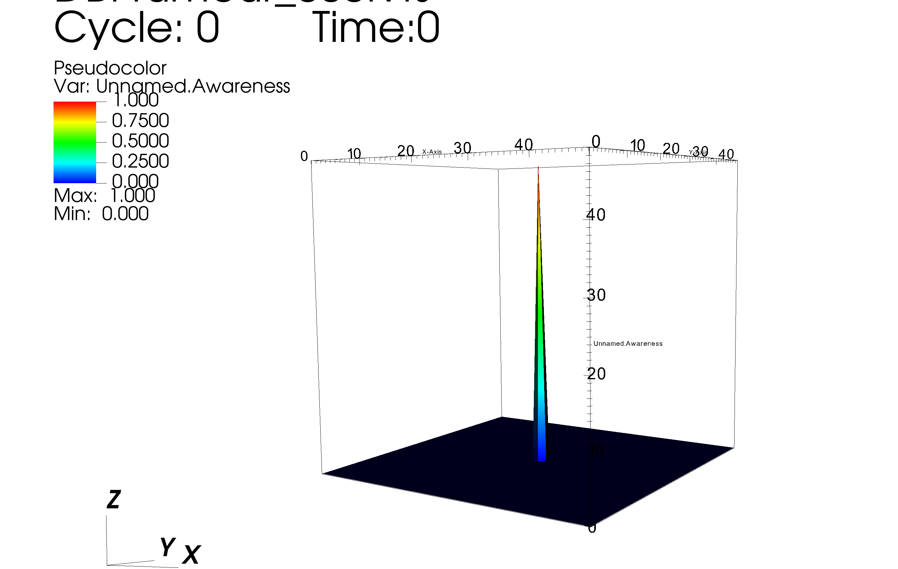
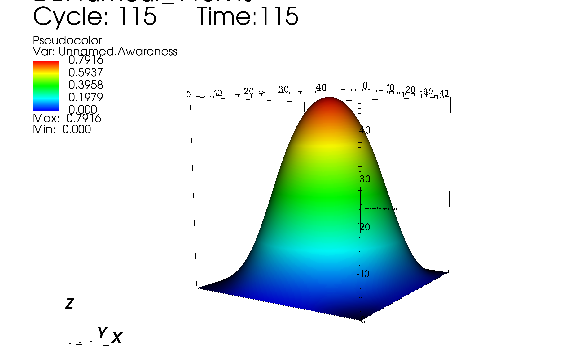

# fisher-kpp-rumour-diffusion


A rumour spreading across a 2-D population, solved as a Fisher-KPP reaction-diffusion problem in
parallel with PETSc. Awareness starts at one point and forms a travelling wave that moves outward at a
constant speed you can predict analytically and then check against the simulation.

**Stack:** C · PETSc (`DMDA`, `TS`) · MPI · ParaView / VisIt

```
∂u/∂t = D ∇²u + α u (1 − u)
```

| Symbol | Meaning |
|---|---|
| `u(x,y,t)` ∈ [0,1] | Fraction of people at a location who know the rumour |
| `D` | How far information travels — the diffusion rate |
| `α` | How convincing it is — the persuasion rate |
| `αu(1−u)` | Logistic saturation. Once everyone at a point knows, it can only spread outward |

**Why this and not the heat equation**

| Model | Behaviour |
|---|---|
| Pure diffusion | The rumour spreads out and **fades** — the peak drops as it widens |
| **Fisher-KPP** | The reaction term regenerates awareness locally → a **travelling wave** that keeps its shape and moves at constant speed until the whole population is converted |

→ That second behaviour is what [social contagion](https://en.wikipedia.org/wiki/Social_contagion) and
[diffusion of innovations](https://en.wikipedia.org/wiki/Diffusion_of_innovations) models are after.

## Numerics

| | |
|---|---|
| Domain | Unit square [0,1]², Dirichlet `u = 0` on the boundary |
| Grid | 50 × 50 default, `h = 1/49 ≈ 0.0204`; override with `-da_grid_x` / `-da_grid_y` |
| Spatial discretisation | 5-point Laplacian, 2nd-order central differences (`DMDA_STENCIL_STAR`, width 1) |
| Time integration | Explicit Runge–Kutta (`TSRK`), adaptive step |
| Decomposition | `DMDA` with `PETSC_DECIDE` both directions; halo exchange via `DMGlobalToLocal` |
| Precision | `PetscScalar` = double |
| Initial condition | `u = 1` at the centre cell, `u = 0` everywhere else |
| Output | `.vts` every 5 steps into `files/` |

### Time step is limited by diffusion, not by the reaction

The scheme is explicit, so it needs `Δt ≲ h²/(4D)`. That bound moves a lot across the parameter range:

| Case | α | D | Wave speed `2√(αD)` | Δt limit | Steps for t = 10 |
|---|---:|---:|---:|---:|---:|
| Default | 0.5 | 0.001 | 0.045 | 0.104 | ~96 |
| Small-town gossip | 1.5 | 0.0001 | 0.024 | 1.04 | ~15 |
| Viral meme | 0.2 | 0.05 | 0.200 | 0.0021 | ~4800 |

- The viral case needs **300× more timesteps** than the gossip case for the same simulated time
- Entirely because `D` is 500× larger

→ **This is the standard trade-off with explicit time stepping on a diffusion term** — and the reason
implicit methods exist. PETSc makes swapping one in a command-line flag.

### Checking it against theory

Fisher-KPP has a known travelling-wave solution moving at `c = 2√(αD)`, which gives a free correctness
check — measure how far the front moved and compare.

| Case | `c` | Distance in t = 10 | Against the 0.5 half-domain |
|---|---:|---:|---|
| Viral meme | 0.200 | 2.0 | Crosses and saturates well before the run ends |
| Small-town gossip | 0.024 | 0.24 | Still mid-domain when the run stops |

Both match what the `.vts` output shows.

## Results

Output is a `.vts` series in `files/`. Open the directory as a database in ParaView or VisIt to animate
the front.

**Step 0** — one point of awareness:



**Step 115** — travelling wave has spread across the domain:



## Build

Needs a configured PETSc install.

```bash
export PETSC_DIR=/path/to/petsc
export PETSC_ARCH=your-arch
make
```

The [`Makefile`](Makefile) pulls in PETSc's own `variables` and `rules`, so include and link flags match
however PETSc was configured rather than being hardcoded.

## Run

**Small-town gossip** — sticky rumour, slow-moving:

```bash
mpiexec -n 4 ./rumour -alpha 1.5 -D 0.0001 -ts_max_time 10.0 -ts_monitor
```

**Viral meme** — weak persuasion, spreads fast:

```bash
mpiexec -n 4 ./rumour -alpha 0.2 -D 0.05 -ts_max_time 10.0 -ts_monitor
```

Everything PETSc exposes is available on the command line, no recompiling:

| Flag | Effect |
|---|---|
| `-da_grid_x 200 -da_grid_y 200` | Finer grid |
| `-ts_type beuler` | Implicit — sidesteps the Δt limit above |
| `-ts_adapt_type none -ts_dt 0.01` | Fixed step |
| `-log_view` | PETSc performance summary |

## Caveats

| Caveat | Detail |
|---|---|
| **Not benchmarked** | No scaling runs. This is a correctness-and-behaviour study, not a performance one |
| **Explicit time stepping** | Fine at these parameters; `D` much above 0.05 needs an implicit solver or a very small `Δt` |
| **Two source edits** | An unused `MatStencil`/`PetscScalar` pair removed from `main`, and a stray `#include <sys/stat.h>` moved from the middle of the file to the top. **Numerics untouched** |

## Layout

```
src/rumour.c    the solver — RHS function, VTK monitor, main
Makefile        uses PETSc's own build variables
results/        rendered frames
```

## Reading

- [Fisher's equation](https://en.wikipedia.org/wiki/Fisher%27s_equation) — the 1-D original and its travelling-wave solution
- [Bass diffusion model](https://en.wikipedia.org/wiki/Bass_diffusion_model) — the same idea in marketing, without the spatial term
- [Social contagion](https://en.wikipedia.org/wiki/Social_contagion) · [Diffusion of innovations](https://en.wikipedia.org/wiki/Diffusion_of_innovations)

## Where this came from

| | |
|---|---|
| Course | *P2.4 — PETSc*, MHPC, ICTP / SISSA Trieste |
| Written | March 2026 |
| Public since | June 2026, in [`prabhkodes/petsc`](https://github.com/prabhkodes/petsc) |
| Also there | The introductory exercises — parallel vectors, sparse matrix assembly, KSP linear solves, 2-D Poisson on a `DMDA`, SNES nonlinear solves, pendulum ODE with `TS` |
| Course repository | Belongs to SISSA, private |
